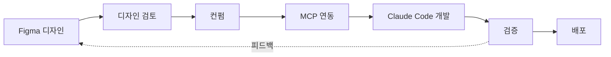

# 디자인 → 개발 워크플로우

> Figma에서 디자인하고 Claude Code로 개발하는 전체 프로세스

## 목차

- [워크플로우 개요](#워크플로우-개요)
- [1단계: Figma 디자인](#1단계-figma-디자인)
- [2단계: 디자인 검토](#2단계-디자인-검토)
- [3단계: 개발 준비](#3단계-개발-준비)
- [4단계: Claude Code 개발](#4단계-claude-code-개발)
- [5단계: 검증 및 배포](#5단계-검증-및-배포)
- [체크리스트](#체크리스트)

## 워크플로우 개요



## 1단계: Figma 디자인

### 1.1 파일 구조 설정

Figma에서 다음과 같은 구조로 파일을 생성합니다:

```
📁 Todal Design System
├── 📄 00_Design Tokens
│   ├── Colors
│   ├── Typography
│   ├── Spacing
│   └── Shadows
├── 📄 01_Components
│   ├── Buttons
│   ├── Inputs
│   ├── Cards
│   └── Modals
├── 📄 02_Icons
└── 📄 03_Layouts

📁 Todal MVP (Phase 1)
├── 📄 00_User Flow
├── 📄 01_할일 관리 화면
├── 📄 02_캘린더 통합 화면
├── 📄 03_드래그앤드롭 인터랙션
└── 📄 04_모바일 반응형
```

### 1.2 디자인 토큰 정의

**Colors (Forest Green 기반)**
```
Primary
├── primary-50: #E8F5F0
├── primary-100: #D1EBE1
├── primary-500: #2D9F6B (Main)
├── primary-600: #248558
└── primary-700: #1A6040

Neutrals (토스 스타일)
├── gray-50: #F9FAFB
├── gray-100: #F3F4F6
├── gray-500: #6B7280
└── gray-900: #111827
```

**Typography**
```
Font Family: Pretendard Variable
├── Heading 1: 32px/140% Bold
├── Heading 2: 24px/140% Bold
├── Body 1: 16px/150% Regular
└── Body 2: 14px/150% Regular
```

### 1.3 컴포넌트 설계

각 컴포넌트에 다음 정보를 포함:

- **Variants**: 크기, 상태, 스타일 변형
- **Properties**: 텍스트, 아이콘, 색상 옵션
- **States**: Default, Hover, Active, Disabled, Focus
- **Responsive**: Desktop, Tablet, Mobile

**예시: Button 컴포넌트**
```
Variants:
├── Size: Small, Medium, Large
├── Type: Primary, Secondary, Ghost
└── State: Default, Hover, Active, Disabled

Properties:
├── Label: Text
├── Icon: Boolean
└── Full Width: Boolean
```

### 1.4 네이밍 규칙

```
프레임: [Category]/[Component Name]/[Variant]
예시: Components/Button/Primary-Large

레이어: [Element Type]-[Description]
예시: text-label, icon-chevron, bg-container
```

## 2단계: 디자인 검토

### 2.1 자체 검토

디자인 완성 후 다음을 확인:

- [ ] 디자인 토큰이 일관되게 사용되었는가?
- [ ] 모든 상태(Hover, Active, Disabled)가 디자인되었는가?
- [ ] 반응형 디자인이 포함되었는가?
- [ ] 접근성(색상 대비, 터치 타겟 크기) 고려했는가?
- [ ] 컴포넌트가 재사용 가능하게 설계되었는가?

### 2.2 피드백 수집

**Figma 댓글 기능 활용**
```
1. 검토가 필요한 프레임 선택
2. 'C' 키 눌러 댓글 추가
3. @mention으로 팀원 태그
4. 상태 라벨 추가:
   - 🟡 Review Needed
   - 🟢 Approved
   - 🔴 Needs Changes
```

### 2.3 최종 컨펌

- [ ] 모든 댓글 해결됨
- [ ] 디자인 시스템과 일관성 확인
- [ ] 기술적 구현 가능성 확인
- [ ] 프레임에 "✅ Dev Ready" 태그 추가

## 3단계: 개발 준비

### 3.1 Figma 링크 정리

개발할 화면/컴포넌트의 Figma 링크를 문서화합니다.

**docs/design/figma-links.md 작성**
```markdown
# Figma 링크 모음

## 디자인 시스템
- [Design Tokens](https://www.figma.com/design/xxx?node-id=1-1)
- [Components](https://www.figma.com/design/xxx?node-id=2-1)

## MVP 화면
- [할일 관리](https://www.figma.com/design/xxx?node-id=10-1)
- [캘린더 통합](https://www.figma.com/design/xxx?node-id=11-1)

## 컴포넌트별 링크
- [Button](https://www.figma.com/design/xxx?node-id=20-1)
- [TodoCard](https://www.figma.com/design/xxx?node-id=21-1)
```

### 3.2 MCP 서버 연결

[FIGMA_MCP_SETUP.md](./FIGMA_MCP_SETUP.md) 가이드를 따라 설정:

```bash
# Figma MCP 서버 추가
claude mcp add --transport http figma https://mcp.figma.com/mcp

# 인증
# Claude Code에서 /mcp → figma → Authenticate
```

### 3.3 개발 우선순위 설정

```markdown
## Phase 1 개발 순서

### 1주차: 디자인 시스템
- [ ] 디자인 토큰 → tailwind.config.ts
- [ ] 기본 컴포넌트 (Button, Input, Card)

### 2주차: 할일 관리
- [ ] TodoList 컴포넌트
- [ ] TodoItem 컴포넌트
- [ ] 할일 CRUD

### 3주차: 캘린더 통합
- [ ] Calendar 컴포넌트
- [ ] 드래그앤드롭 구현

### 4주차: 통합 및 테스트
- [ ] 화면 통합
- [ ] E2E 테스트
```

## 4단계: Claude Code 개발

### 4.1 디자인 토큰 추출

**Claude Code 프롬프트**
```
이 Figma 디자인 시스템에서 디자인 토큰을 추출해줘:
https://www.figma.com/design/xxx?node-id=design-tokens

다음 형식으로 tailwind.config.ts에 추가할 수 있게 만들어줘:
- colors: Primary, Neutral 팔레트
- typography: 폰트 패밀리, 크기, 줄간격
- spacing: 간격 시스템
- shadows: 그림자 효과
- borderRadius: 둥근 모서리

기존 tailwind.config.ts 파일을 읽고 병합해줘.
```

### 4.2 컴포넌트 개발

**단계별 프롬프트**

**1. 기본 컴포넌트**
```
Button 컴포넌트를 구현해줘:
Figma: https://www.figma.com/design/xxx?node-id=button

요구사항:
- TypeScript + React
- Tailwind CSS 사용
- 모든 variants 포함 (size, type)
- 모든 states 구현 (hover, active, disabled, focus)
- 접근성 고려 (aria-label, keyboard navigation)
- Storybook 스토리 작성
- 파일 위치: components/ui/Button.tsx
```

**2. 복합 컴포넌트**
```
TodoCard 컴포넌트를 구현해줘:
Figma: https://www.figma.com/design/xxx?node-id=todo-card

요구사항:
- 체크박스, 제목, 라벨, 드래그 핸들 포함
- Button 컴포넌트 재사용
- 드래그앤드롭 준비 (data attribute 추가)
- hover, focus 상태 구현
- 파일 위치: components/todo/TodoCard.tsx
```

**3. 페이지 레이아웃**
```
메인 화면 레이아웃을 구현해줘:
Figma: https://www.figma.com/design/xxx?node-id=main-layout

요구사항:
- 좌측: TodoList (40% 너비)
- 우측: Calendar (60% 너비)
- 반응형: 768px 이하에서 세로 스택
- TodoCard, Calendar 컴포넌트 통합
- 파일 위치: app/(main)/page.tsx
```

### 4.3 인터랙션 구현

**드래그앤드롭**
```
할일 카드를 캘린더로 드래그하는 기능 구현:
참고 디자인: https://www.figma.com/design/xxx?node-id=dnd-interaction

요구사항:
- dnd-kit 라이브러리 사용
- TodoCard에서 드래그 시작
- Calendar에 드롭 가능
- 드래그 중 시각적 피드백
- 드롭 시 일정 생성
```

### 4.4 검증 프롬프트

```
지금 구현한 컴포넌트가 Figma 디자인과 일치하는지 확인해줘:
Figma: https://www.figma.com/design/xxx?node-id=xxx

다음을 체크해줘:
- 색상, 간격, 타이포그래피 일치
- 모든 상태(hover, focus, active) 구현
- 반응형 동작 확인
- 접근성 요구사항 충족

차이점이 있으면 수정해줘.
```

## 5단계: 검증 및 배포

### 5.1 디자인 QA

**비교 체크리스트**
- [ ] 색상이 디자인 토큰과 일치
- [ ] 간격(padding, margin)이 디자인과 일치
- [ ] 타이포그래피(폰트, 크기, 줄간격) 일치
- [ ] 모든 인터랙션 상태 구현됨
- [ ] 반응형 동작 확인
- [ ] 애니메이션/트랜지션 구현

**Chrome DevTools로 확인**
```
1. 개발 서버 실행: pnpm dev
2. Chrome에서 http://localhost:3000 열기
3. DevTools (F12) 열기
4. Elements 탭에서 스타일 확인
5. Figma 디자인과 나란히 비교
```

### 5.2 기능 테스트

```bash
# 단위 테스트 실행
pnpm test

# E2E 테스트 실행
pnpm test:e2e

# Storybook으로 컴포넌트 검토
pnpm storybook
```

### 5.3 피드백 반영

디자인과 차이가 있다면:

**Claude Code에 요청**
```
Button 컴포넌트의 패딩을 수정해줘:
현재: px-4 py-2
Figma 디자인: px-6 py-3 (https://www.figma.com/design/xxx?node-id=button)

디자인과 정확히 일치하도록 수정해줘.
```

### 5.4 배포

```bash
# Vercel 배포
git add .
git commit -m "feat: 할일 관리 화면 구현"
git push origin main

# 배포 URL 확인
# Figma 댓글에 배포 URL 공유하여 최종 확인
```

## 체크리스트

### Figma 디자인 단계
- [ ] 디자인 시스템 구축 완료
- [ ] 모든 컴포넌트 variants/states 디자인
- [ ] 반응형 디자인 포함
- [ ] 접근성 고려 (색상 대비, 크기)
- [ ] 네이밍 규칙 준수
- [ ] "✅ Dev Ready" 태그 추가

### 디자인 검토 단계
- [ ] 자체 검토 완료
- [ ] 피드백 수집 및 반영
- [ ] 모든 댓글 해결
- [ ] 최종 컨펌 완료

### 개발 준비 단계
- [ ] Figma 링크 문서화
- [ ] MCP 서버 연결 및 인증
- [ ] 개발 우선순위 설정

### Claude Code 개발 단계
- [ ] 디자인 토큰 추출 및 적용
- [ ] 기본 컴포넌트 구현
- [ ] 복합 컴포넌트 구현
- [ ] 페이지 레이아웃 구현
- [ ] 인터랙션 구현
- [ ] 디자인과 일치 확인

### 검증 및 배포 단계
- [ ] 디자인 QA 완료
- [ ] 기능 테스트 통과
- [ ] 피드백 반영
- [ ] 배포 완료
- [ ] 최종 확인

## 참고 자료

- [Figma MCP 설정 가이드](./FIGMA_MCP_SETUP.md)
- [Figma 링크 모음](./design/figma-links.md)
- [개발 가이드](./DEVELOPMENT.md)
- [워크플로우](./WORKFLOW.md)

## 팁

### 효율적인 개발을 위한 프롬프트 팁

**명확한 요구사항 제시**
```
❌ 나쁜 예: "버튼 만들어줘"
✅ 좋은 예: "Figma 디자인을 기반으로 Button 컴포넌트를 구현해줘:
   링크: [URL]
   - TypeScript + Tailwind
   - 모든 variants 포함
   - Storybook 스토리 추가"
```

**단계별 진행**
```
1. 먼저 디자인 토큰 추출
2. 기본 컴포넌트부터 구현
3. 복합 컴포넌트 조립
4. 페이지 레이아웃 구성
5. 인터랙션 추가
```

**검증 요청**
```
각 단계마다 "Figma 디자인과 일치하는지 확인해줘" 요청
차이점 발견 시 즉시 수정
```

---

**Last Updated**: 2025-10-17
